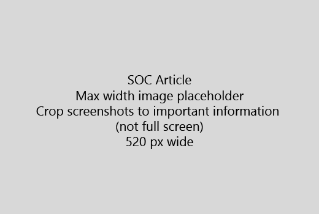

Почати вашу статтю з дуже короткий вступ (1, пропозиція). Поставте себе на місце читача - чому вони тут? Що вони роблять? 
  
1. Отримати прямий для швидкого перелік заходів для виконання поставленого завдання.
    
    Якщо потрібно, щоб пояснити концепцію, або вони повинні робити передумовою кроки, додати стислий перелік нижче крок, де вони потрібні і [посилання](https://support.office.com/article/f37e7984-cf03-4fde-92d3-82970d7e241b.aspx) на концепції або кроки. 
    
2. Тримати процедур короткий - бажано 5 або менше кроків, не більше 8.
    
3. Використовувати **стиль інтерфейсу користувача** для елементів інтерфейсу користувача, або для тексту людей потрібно ввести. 
    
4. Використання дієслів вибрати виділити, або ввести як дії та відформатувати меню як **меню** \> **команди**.
    
5. За бажанням додати скріншот для контексту (інтерфейс користувача дуже важко знайти, або вона потрібна для завершення завдання).
    
    Максимальна ширина: 520 пікселів. Використовувати стандартну тему, не показують будь-якої особистої інформації та обітнути, щоб показати тільки те, що має відношення. 
    
    
  
Якщо ви хочете додати відео або скріншот, використовувати два стовпці сітки і кроки в ліворуч і відео або скріншот всередині праворуч - побачити [кроки і приклад відео сітки](https://support.office.com/article/14ce8e82-efa0-47f5-bb84-94f078db3dae.aspx). 
  
Націлювання не більше 500 слів статті.
  
# Приклад статті

[Змінити мою фотографію](https://support.office.com/article/555376e0-1fca-49ba-8434-307a0525c767.aspx)
  

