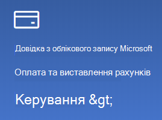

# Змінення відомостей облікового запису MicrosoftChange my Microsoft account information

За потреби [https://account.microsoft.com](https://account.microsoft.com/) перейдіть до потрібного пункту та ввійдіть у неї.Go to [https://account.microsoft.com](https://account.microsoft.com/) and sign in if necessary. Після цього ви переймете на приладну дошку облікового запису.This will take you to your account dashboard.  

**Редагування мого імені та особистих відомостей****Edit my name and personal information**

1. На приладну дошку облікового запису поруч із зображенням і іменем облікового запису клацніть три крапки (додаткові дії) > Редагувати профіль\*\*.On your account dashboard, next to your account picture and name, click the three dots (more actions) > Edit profile\*\*.
2. На сторінці **Редагування профілю скористайтеся** посиланнями, наданими, щоб змінити рисунок профілю, ім'я, дату народження, розташування та параметри мови відображення.On the **Edit profile** page, use the links provided to change your profile picture, name, date of birth, location, and display language preference. Зверніть увагу на посилання на профілі облікового Skype Xbox або Skype, де можна змінити докладні відомості, характерні для цих облікових записів.Note the links to your Xbox or Skype account profiles, where you can change details specific to these accounts.

**Керування адресами електронної пошти та номерами телефонів****Manage e-mail addresses and phone numbers**

Обліковий запис Microsoft має одну або кілька адрес електронної пошти або номерів телефонів, пов'язаних із ним як "псевдоніми".A Microsoft account has one or more e-mail addresses or phone numbers associated with it as “aliases.” Ось як це можна зробити:To manage these:

1. На приладну дошку облікового запису поруч із зображенням і іменем облікового запису клацніть три крапки (додаткові дії) > **Редагувати профіль**.On your account dashboard, next to your account picture and name, click the three dots (more actions) > **Edit profile**.
2. На сторінці **Редагування профілю** клацніть елемент Керування способами входу **в обліковий запис Microsoft**.On the **Edit profile** page, click **Manage how you sign in to Microsoft**. 
3. В побачите список псевдонімів облікових записів, а також зможете керувати списком, зокрема додавати й видаляти адреси електронної пошти й номери телефонів.You will see a list of account aliases, and you can manage the list, including adding and deleting e-mail addresses and phone numbers. Тут ви також можете вибрати псевдоніми, які можна використовувати для входу в обліковий запис, а також визначити основний псевдонім, який відображатиметься на Windows 10 пристрої.Here you can also select which aliases can be used to sign in to the account, and which alias is considered “primary,” which will be displayed on your Windows 10 devices.

**Керування методами оплати, а також іменем і адресою для виставлення рахунків****Manage payment methods, as well as name and address for billing** 

1. На приладну дошку облікового запису поруч із зображенням і іменем облікового запису клацніть три крапки (додаткові дії) > **Редагувати профіль**.On your account dashboard, next to your account picture and name, click the three dots (more actions) > **Edit profile**.
2. У **розділі Оплата & виставлення рахунків** натисніть кнопку **Керування**.Under **Payment & billing** click **Manage**.

    

3. Тут можна додати, змінити та видалити способи оплати та пов'язані з ними адреси виставлення рахунків.Here you can add, edit, and remove payment methods and their associated billing addresses. 
