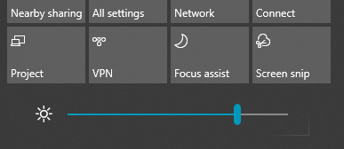

# Змінення яскравості екрана у Windows 10

Якщо windows 10 новіша за версію 1903, повзунок яскравості в центрі підтримки має повзунок.  Щоб відкрити центр підтримки,  натисніть кнопку Сповіщення в крайній правій частині панелі завдань або натисніть **клавіші Windows Home + A** на клавіатурі.

Якщо у Вас раніша версія Windows 10, повзунок яскравості можна знайти в меню Параметри **[> > Дисплей](ms-settings:display?activationSource=GetHelp)**.

**Примітки.**

- На настільних КОМП'ютерах із зовнішнім монітором може не відображатися повзунок Змінення яскравості вбудованого дисплея. Щоб змінити яскравість зовнішнього монітора, використовуйте елементи керування на моніторі.
- Якщо у вас немає настільного ПК, але повзунок не відображається або не працює, спробуйте оновити драйвер дисплея. У полі пошуку на панелі завдань введіть **Диспетчер** пристроїв , а потім виберіть пункт **Диспетчер** пристроїв у списку результатів пошуку. У **диспетчері пристроїв** виберіть **елемент Відеоадаптери**, а потім виберіть відеоадаптер. Натисніть і утримуйте (або клацніть правою кнопкою миші) ім'я відеоадаптера та виберіть **команду Оновити драйвер**; та дотримуйтеся вказівок.
