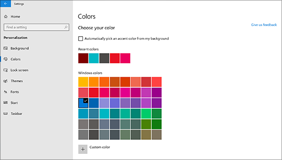

# Змінення фону робочого стола та кольорів

Щоб змінити настройки кольорів, перейдіть до меню Пуск Настройки Персоналізація Кольори , а потім виберіть власний колір або дозвольте Windows отримати на основі фону колірну  >    >    >  колірну схему.

Щоб змінити фон робочого стола, перейдіть до меню Пуск Настройки Персоналізація Фон , а потім виберіть зображення, суцільний колір або створіть показ  >    >    >  слайдів із зображень. 

Потрібно більше фонових зображень і кольорів робочого стола? [Відвідайте Microsoft Store,](https://www.microsoft.com/store/collections/windowsthemes) щоб вибрати з десятків безкоштовних тем.
