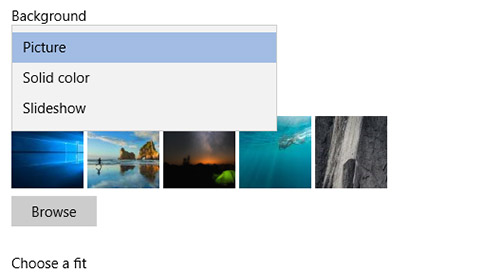

# Змінення тла робочого стола та кольорів

Щоб змінити налаштування кольорів, перейдіть до розділу **почати** > **налаштування** > для**персоналізації** > **кольорів**, а потім виберіть свій колір або нехай Windows витягне Колір акценту з фону.

Щоб змінити тло робочого стола, перейдіть до розділу **початок** > **налаштування** > **Персоналізація** > **фону**, а потім виберіть зображення, суцільний колір або створіть слайд-шоу з фотографій. 

Бажаєте більше фонів і кольорів робочого стола? Відвідайте [Microsoft Store](https://www.microsoft.com/store/collections/windowsthemes) , щоб вибрати з десятків безкоштовних тем.
