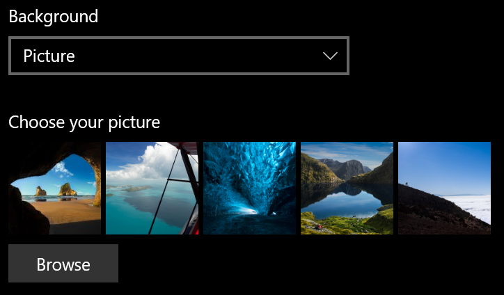
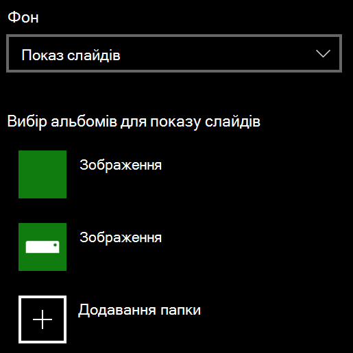

# Як змінити тло екрана блокуванняChange your lock screen background

- Перейдіть до **налаштування** > \*\*\*\* > **екрана блокування**персоналізації.Go to **Settings** > **Personalization** > **Lock screen**. Або натисніть [тут](ms-settings:lockscreen?activationSource=GetHelp).Or click or tap [here](ms-settings:lockscreen?activationSource=GetHelp).

- Щоб установити настроюване фонове зображення, виберіть у розкривному списку **тло** пункт **рисунок** і виберіть або **перейдіть** до зображення.To set a custom background picture, select **Picture** from the **Background** drop-down list, and choose or **Browse** to the picture.

  

- Щоб налаштувати показ слайдів для настроюваних зображень, виберіть **слайд-шоу** з розкривного списку **тла** та виберіть альбом або додайте папку, яка містить зображення для показу слайдів.To set up a slideshow of custom pictures, select **Slideshow** from the **Background** drop-down list, and choose an album or add a folder that contains the pictures for the slideshow.

  
