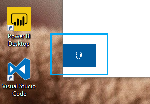

# Зв'яжіться з нами, натиснувши кнопку навушників

Якщо ви бажаєте звернутися до служби підтримки Microsoft, натисніть кнопку Зверніться до **нас** у нижньому лівому куті цієї програми. У відкритому вікні ви знайдите відповідний канал підтримки, вибравши категорію продуктів і питань.

Ви можете продовжувати взаємодіяти з іншими програмами навіть після того, як розпочали сеанс "Зверніться до нас". Панель Зверніться до нас можна тимчасово згорнути, клацнувши будь-де в програмі. Щоб повернутися до того самого сеансу, просто натисніть кнопку **Зв'язатися з нами** ще раз.
