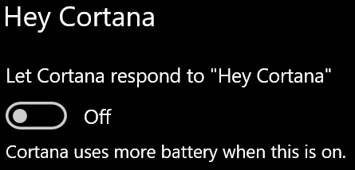

# Cortana не говори зі мною або не чує менеCortana doesn’t talk to me or can’t hear me

Якщо ви намагаєтеся скористатися функцією "Hey Cortana", яка дає змогу розмовляти з Cortana, не вибираючи кнопку Cortana на панелі завдань або кнопку мікрофон на панелі Cortana, підтвердьте, що цю функцію активовано:If you are trying to use the "Hey Cortana" feature, which allows you to talk to Cortana without selecting the Cortana button on the taskbar or the microphone button in the Cortana panel, confirm that the feature is enabled:

1. Відкрийте **меню Пуск**і виберіть пункт **[настройки > Cortana](ms-settings:cortana?activationSource=GetHelp)**.Go to **Start**, then select **[Settings > Cortana](ms-settings:cortana?activationSource=GetHelp)**.
2. У розділі **Hey Cortana**Увімкніть перемикач **дозволити Cortana відповідати на "Hey Cortana"** **.**Under **Hey Cortana**, switch the **Let Cortana respond to "Hey Cortana"** toggle to **On**.

**Чи є ваші налаштування конфіденційності, які заважають вам чути Cortana?****Are your privacy settings preventing Cortana from hearing you?**

Настройки конфіденційності можуть завадити реагуванні Cortana на ваш голос.Your privacy settings can prevent Cortana from responding to your voice.
- Перевірте, щоб переконатися, що онлайнову розпізнавання мовлення ввімкнено:Check to make sure Online Speech recognition is turned on:
    - Відкрийте **меню Пуск**і виберіть пункт **[настройки > конфіденційність > мовлення](ms-settings:privacy-speech?activationSource=GetHelp)**.Go to **Start**, then click **[Settings > Privacy > Speech](ms-settings:privacy-speech?activationSource=GetHelp)**.
    - У розділі **онлайнову розпізнавання мовлення**, Увімкніть параметр **Увімкнути**.Under **Online speech recognition**, switch the setting to **On**.
- Переконайтеся, що Cortana має дозвіл на доступ до мікрофона.Check to make sure Cortana has permission to access your microphone. 
    - Відкрийте меню Пуск і виберіть пункт **[настройки > конфіденційність > мікрофон](ms-settings:privacy-microphone?activationSource=GetHelp)**.Go to Start, then click **[Settings > Privacy > Microphone](ms-settings:privacy-microphone?activationSource=GetHelp)**.
    - У розділі **вибір програм, які можуть отримати доступ до мікрофона**, знайдіть **Cortana** у списку програм і служб і переконайтеся, що перемикач переключіться **Далі**.Under **Choose which apps can access your microphone**, look for **Cortana** within the list of apps and services and make sure the switch is toggled to **On**.

Крім того, переконайтеся, що ваші колонки та мікрофони працюють для того, щоб розмовляти з Cortana.Moreover, please also make sure that your speakers or microphones are up and working in order to talk to Cortana.
