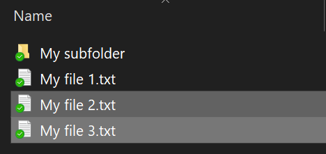
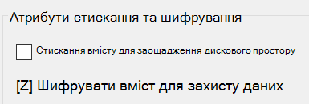

# Шифрування файлів і папок у Windows 10

За допомогою BitLocker можна зашифрувати весь диск, але для шифрування лише окремих файлів або папок (і їхнього вмісту):

1. У **Файловому** провіднику виберіть файли або папки, які потрібно зашифрувати. У цьому прикладі виділено два файли:

    

2. Клацніть вибрані файли правою кнопкою миші та виберіть пункт **Властивості.**

3. У вікні **Властивості** клацніть елемент **Додатково.**

4. У вікні **Додаткові властивості** встановіть прапорець **Шифрувати** вміст для захисту даних:

    

5. Натисніть кнопку **OK**.
