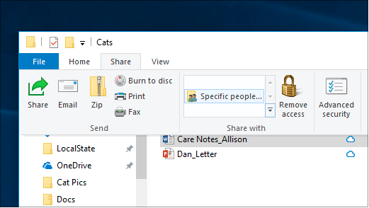
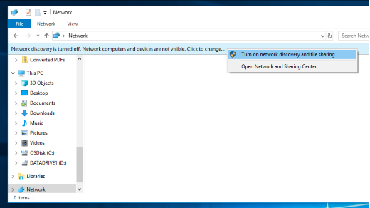

# Надання спільного доступу до файлів через мережу в ОС Windows 10File sharing over a network in Windows 10

**Примітка**. Якщо ви раніше використовували домашню групу для надання спільного доступу до файлів, зверніть увагу, що в операційній системі Windows 10 (версія 1803) не було видалено домашню групу.**Note**: If you previously used HomeGroup for file sharing, please note that HomeGroup has been removed from Windows 10 (Version 1803). Тепер можна надавати спільний доступ до принтерів і файлів, використовуючи вбудовані функції в ОС Windows 10.You can now share printers and files by using built-in features in Windows 10.

**Надання спільного доступу до файлів і папок через мережу****To share files or folders over a network**

- У **Файловому провіднику**виберіть файл > відкрийте вкладку **спільний доступ** у верхній > у розділі **спільний доступ із** , виберіть елемент **певні користувачі**.In **File Explorer**, select a file > click the **Share** tab at the top > in the **Share with** section, click **Specific people**.

    
          
- Якщо ви вибрали кілька файлів одночасно, ви можете надати спільний доступ до них таким самим чином.If you select multiple files at once, you can share them all in the same way. Вона працює також з папками.It works for folders, too.

**Перегляд пристроїв у мережі, які мають спільний доступ до файлів****To see devices on the network that are sharing files**

- У **Файловому провіднику**перейдіть до **мережі**.In **File Explorer**, go to **Network**. Якщо пошук мережі не активовано, з'явиться повідомлення про помилку "Пошук мережі вимкнуто..."If Network discovery is not enabled, you will see an error message "Network discovery is turned off..."

- Натисніть кнопку **Пошук мережі, вимкнувши** банер, а потім виберіть пункт **Увімкнути пошук мережі та спільний доступ до файлів**.Click the **Network discovery is turned off** banner, then click **Turn on network discovery and file sharing**.

    

[Дізнайтеся більше про надання спільного доступу до файлів через мережуRead more about file sharing over a network](https://support.microsoft.com/help/4092694/windows-10-file-sharing-over-a-network)

[Надання спільного доступу до файлів за допомогою програм, OneDrive, повідомлень електронної пошти тощоShare files using apps, OneDrive, emails, and more](https://support.microsoft.com/help/4027674/windows-10-share-files-in-file-explorer)
