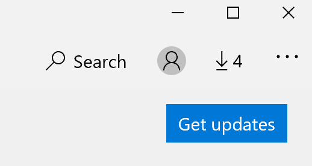

# Як вирішити мову інтерфейсу додатків

Після змінення мови відображення у Windows 10 деякі програми все ще можуть використовувати попередню мову під час їх відкривання. Це відбувається тому, що нові версії програм для цієї мови потрібно завантажити з магазину. Щоб вирішити цю проблему, можна дочекатися автоматичного оновлення, або вручну інсталювати оновлену версію програм.

Щоб інсталювати оновлення вручну, відкрийте **Microsoft Store** і натисніть кнопку **завантаження та оновлення** у верхньому правому куті. Натисніть кнопку **отримати оновлення**. Якщо після завершення оновлення мова не зміниться, спробуйте перезапустити комп'ютер.

Щоб дізнатися більше про налаштування мови вводу та відображення, див. [керування налаштуваннями мови вводу та інтерфейсу у Windows 10](https://support.microsoft.com/help/4027670/windows-10-add-and-switch-input-and-display-language-preferences).
