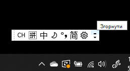
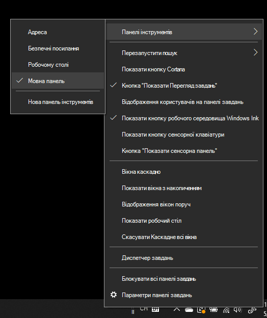
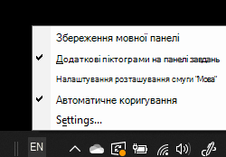

# Приховання, відображення та скидання мовної панеліHide, display, or reset the language bar

**Щоб згорнути мовну панель:****To minimize the language bar:**

Можна натиснути кнопку згортання у верхньому правому куті мовної панелі.You can click the minimize button on the top right corner of the language bar. Крім того, ви можете просто перетягнути мовну панель на панель завдань, яка автоматично згорне її.Or, you can just drag the language bar to the task bar, which will automatically minimize it.

**Щоб спливаюче вікно мовної панелі:****To pop out the language bar:**

Якщо ви не бажаєте пристикувати мовну панель на панелі завдань, клацніть правою кнопкою миші  будь-яке пусте місце на панелі завдань і зніміть прапорець Мовна панель у меню Панелі інструментів.If you don't want to dock the language bar in the taskbar, right-click any empty space in the taskbar, and uncheck the **Language bar** option in the Toolbars menu. Мовна панель з'явиться за межами панелі завдань, як на попередньому знімку екрана.This will make the language bar appear outside the taskbar, just like the previous screenshot.

**Щоб відновити мовну панель за замовчуванням:****To restore the language bar to default:**

Клацніть правою кнопкою миші кнопку мови на панелі інструментів і виберіть **у** меню пункт Відновити мовну панель.Right-click the language button in the toolbar, and click **Restore the language bar** option in the menu. Так його буде відновлено до за замовчуванням.This will restore it to default.

