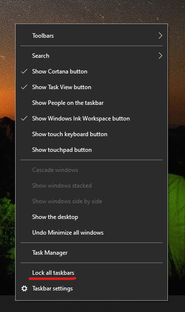

# Переміщення панелі завдань з обох боків або на верхню сторону робочого столаMove the taskbar to either side or the top of your desktop

Спочатку переконайтеся, що панель завдань розблоковано.First, please confirm that the taskbar is unlocked. Щоб дізнатися, чи не розблоковано ваш обліковий запис, клацніть  правою кнопкою миші будь-яке пусте місце на панелі завдань і перевірте, чи поруч із ним є прапорець Заблокувати панель завдань.To find out whether yours is unlocked, right-click any empty space on the taskbar and see whether **Lock the taskbar** has a checkmark next to it. Якщо позначка є, панель завдань заблоковано, і її не можна перемістити.If there is a checkmark, the taskbar is locked and cannot be moved. Натисніть **кнопку Заблокувати панель завдань** один раз, щоб розблокувати її та зняти позначку.Clicking **Lock the taskbar** once will unlock it and remove the checkmark.

Якщо панель завдань відображається на кількох моніторах, відображається повідомлення Заблокувати **всі панелі завдань.**If you have multiple monitors that display the taskbar, you will see **Lock all taskbars**.

Після розблокування панелі завдань можна натиснути й утримувати будь-яке пусте місце на панелі завдань і перетягнути її в потрібне місце на екрані.Once the taskbar is unlocked, you can press and hold any empty space on the taskbar and drag it to the location you want on the screen. Це також можна зробити, клацнувши правою кнопкою миші будь-яке пусте місце на панелі завдань і перейшовши до параметрів панелі завдань> розташування ** панелі завдань на екрані.**You can also do so by right-clicking on any empty space on the taskbar and go to **[Taskbar settings](ms-settings:taskbar?activationSource=GetHelp) > Taskbar location on screen**.
