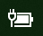

# Піктограма живлення або акумулятора не відображається у Windows 10

Якщо у вашому пристрої з Windows 10 є акумулятор (наприклад, ноутбук або планшет чи ПК, підключений через USB до ДБЖ), зазвичай на панелі завдань поруч із годинником відображається піктограма живлення/акумулятора, наприклад:

Якщо піктограму не видно, можливо, її приховано.

1. Перейдіть у меню **[Параметри > Персоналізація > Панель завдань](ms-settings:taskbar?activationSource=GetHelp)**.

2. В області сповіщень натисніть **Вибрати, які піктограми показувати на панелі завдань**.

3. У списку знайдіть елемент **Живлення** й установіть його перемикач у положення **Увімк.**.

    

**Виправлення неполадок**

Якщо ви виконали вказані вище інструкції, але перемикач **Живлення** затінено або його не видно, у полі пошуку на панелі завдань введіть **диспетчер пристроїв** і виберіть **Диспетчер пристроїв** у списку результатів. У розділі **Акумулятори** натисніть правою кнопкою миші акумулятор свого пристрою та виберіть **Вимкнути**, а потім – **Так**. Зачекайте кілька секунд, а потім натисніть правою кнопкою миші акумулятор і виберіть **Увімкнути**. Перезавантажте пристрій.

Якщо ви виконали вказані вище інструкції, але піктограма акумулятора не з’явилася на панелі завдань, у полі пошуку на панелі завдань введіть **диспетчер завдань** і натисніть **Диспетчер завдань** у списку результатів. На вкладці **Процеси** в розділі **Назва** натисніть правою кнопкою миші **Провідник** і виберіть **Перезавантажити**.
