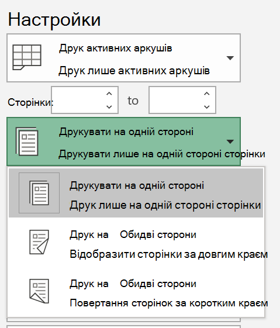
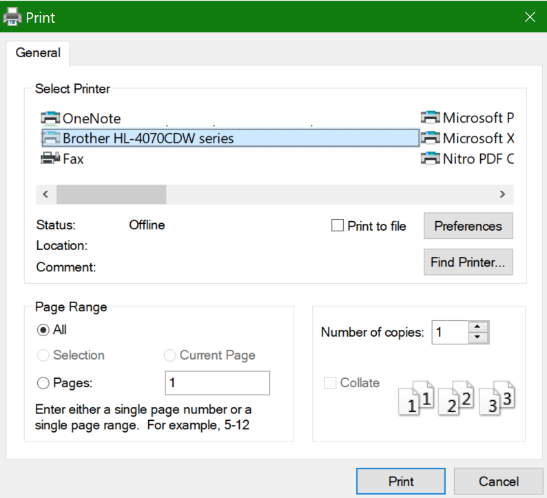

# Друк на обох сторонах паперу (двобічний друк)Printing on both sides of paper (duplex printing)

**Чи підтримує принтер двобічний друк?****Is my printer capable of duplex printing?**

Зведення функцій принтера або вручну слід указати, чи можна друкувати на обох сторонах аркуша паперу, який також називають двобічним друком.Your printer’s feature summary or manual should tell you whether it is capable of printing on both sides of the paper, also known as “duplex printing.” Якщо у вас є Microsoft Office, щоб дізнатися про це, відкрийте програму Office, як-от Word або Excel, і виберіть файл **> Друк**, щоб переконатися, що вибрано правильний принтер, і шукайте можливості в розділі Параметри.If you have Microsoft Office, another way to find out is by opening an Office app like Word or Excel, going to **File > Print**, making sure the right printer is selected, and looking for the capability in the Settings section. Наприклад:For example: 

**Двобічний друк у Microsoft Office****Duplex printing in Microsoft Office**

Якщо принтер підтримує друк з обох сторін, у меню Файл **>** Друк у програмі Office з'являться параметри "Друкувати на обох сторонах", як показано в прикладі вище.If your printer is capable of printing on both sides, when you go to **File > Print** in the Office app, you will see an option to “Print on Both Sides,” as shown in the example above.  Виберіть потрібний тип двобічного друку (перегорніть довгий край  або перегорніть його за коротким краєм) і натисніть кнопку Друк, щоб почати роздруківку.Select the type of duplex printing you want (flip on long edge, or flip on short edge), and click **Print** to start the printout.

**Двобічний друк із будь-якої програми****Duplex printing from any application**

У багатьох програмах під час друку відображається загальне діалогове вікно друку, яке виглядає так:In many apps when you print you will see a general print dialog that looks like this: 

Переконайтеся, що вибрано правильний принтер, а потім **натисніть кнопку Параметри,** щоб відкрити вікно параметрів принтера.Make sure the right printer is selected, then click **Preferences** to open the printer preferences window. Якщо принтер підтримує двобічний друк, у цьому вікні вмикати цей параметр для поточного завдання друку буде відображатися.If the printer is capable of duplex printing, the ability to enable this for the current print job will show in that window.
