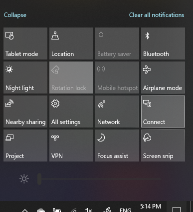

# Проектування на ПК

На пристрої призначення (для проектування на) введіть "Параметри проекцій", щоб відкрити сторінку "Параметри" в розділі **Проектування на цей ПК.** Потім переконайтеся, що:
- На деяких пристроях із Windows і Android на цьому КОМП'ютері встановлено значення Завжди вимкнуто.
- Для розкривного меню "Попросити проектувати на цей КОМП'ютер" установлено значення Щоразу, **коли потрібне підключення.**
- Для розкривного меню "Потрібний PIN-код для парування" встановлено значення **Ніколи.**

На пристрої призначення запустіть програму **"Підключення".** Для цього відкрийте меню Пуск і знайдіть пункт "Підключитися". 

Потім на вихідному пристрої, з якого ви намагаєтеся проектувати:

1. Натисніть **клавіші Windows+A,** щоб відкрити Центр підтримки.
2. Натисніть кнопку **Підключитися.**
3. Виберіть пристрій, на який потрібно проектувати екран.

Після виконання описаних вище кроків екран вихідного пристрою має відображатися так, ніби це додатковий монітор.
