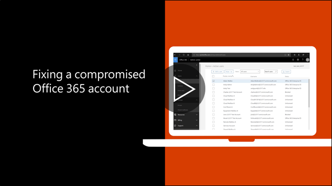

# Рекомендований кроки зробити, якщо скомпрометований обліковий запис

  
1. [Скидання пароля користувача](https://support.office.com/article/7a5d073b-7fae-4aa5-8f96-9ecd041aba9c) відразу. Не спілкувалися новий пароль по електронній пошті для кінцевих користувачів. 
    
2. Видалити будь-які підозрілі [пересилання адреси](https://support.office.com/article/ab5eb117-0f22-4fa7-a662-3a6bdb0add74) встановлена на рівні поштової скриньки. 
    
3. Видалити будь-які підозрілі [Вхідні правила](https://support.office.com/article/1433E3A0-7FB0-4999-B536-50E05CB67FED) Верзилії поштової скриньки. 
    
4. Якщо користувач намагається перейти відправка електронної пошти, [перейдіть на обмежені користувачі розблокувати обліковий запис](https://protection.office.com/?hash=/restrictedusers). Після цього, користувач повинні мати можливість продовжити надсилання повідомлень протягом 1 години.
    
5. Видалити обліковий запис користувача з будь-якої [адміністративної рольових груп](https://support.office.com/article/eac4d046-1afd-4f1a-85fc-8219c79e1504) , поки ви впевнені, що рахунок більше не скомпрометована. 
    
Щоб звести до мінімуму потенціал даних порушення або порушення безпеки облікового запису в майбутньому, ми рекомендуємо прочитати наші [найкращі практики статті Office 365 безпеки](https://support.office.com/article/9295e396-e53d-49b9-ae9b-0b5828cdedc3).
  

