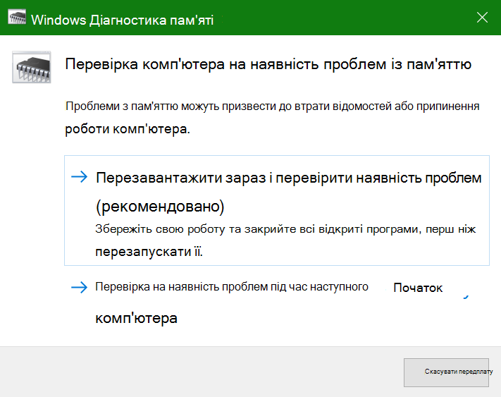
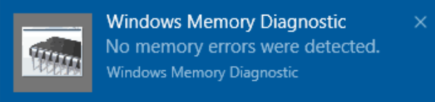

# Запуск засобу діагностики пам'яті Windows у Windows 10

Якщо Windows і програми на ПК аварійно завершують роботу, закріплюються або виконуються нестабільно, можливо, виникнуть проблеми з пам'яттю ПК (ОЗП). Ви можете запустити засіб діагностики пам'яті Windows, щоб перевірити наявність проблем із оперативною пам'яттю ПК.

У полі пошуку на панелі завдань введіть "Діагностика **пам'яті"**, а потім виберіть пункт Діагностика **пам'яті Windows**. 

Щоб запустити діагностику, ПК потрібно перезавантажити. Можна відразу перезапустити програму (спочатку збережіть свою роботу та закрийте відкриті документи та повідомлення електронної пошти) або заплануйте автоматичний запуск діагностики під час наступного перезавантаження ПК.

Коли комп'ютер перезавантажиться, засіб **діагностики пам'яті Windows** запуститься автоматично. Стан і перебіг виконання відображатимуться під час запуску діагностики, а ви можете скасувати діагностики, натиснувши клавішу **Esc** на клавіатурі.

Коли діагностика завершиться, Windows завантажиться у звичайний режим.
Коли робочий стіл відобразиться, одразу після перезавантаження  з'явиться сповіщення (біля піктограми Центру підтримки на панелі завдань), щоб указати, чи знайдено всі помилки пам'яті. Наприклад:

Ось піктограма Центру підтримки:  

І зразок сповіщення: 

Якщо ви пропустили сповіщення,  на панелі завдань клацніть піктограму  Центру підтримки, щоб відобразити центр підтримки та переглянути список сповіщень, які можна прокручувати.

Щоб переглянути докладні відомості, **введіть** подію в поле пошуку на панелі завдань, а потім виберіть **пункт Перегляд подій**. В області **"Перегляд подій"** ліворуч перейдіть до пункту Журнали **Windows > система.** В області праворуч перегляньте список униз  по стовпцях Джерело, доки не побачите події зі значенням Source **value MemoryDiagnostics-Results.** Виділіть кожну таку подію та перегляньте відомості про результат у полі на **вкладці** Загальні під списком.
