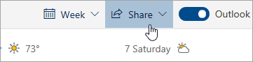

# Спільне використання з Outlook в Інтернеті

У календарі на панелі інструментів вгорі сторінки виберіть елемент **спільний доступ**і виберіть календар, до якого потрібно надати спільний доступ.

    

**Примітка**: ви не можете обмінюватися календарями, які належать іншим людям.

- Введіть ім'я або адресу електронної пошти особи, до якої потрібно надати спільний доступ до календаря.
- Виберіть спосіб використання календаря:
    - **Може переглядати, коли я зайнятий**   дозволяє їм бачити, коли ви зайняті, але не включають в себе деталі, як місце події.
    - **Можна переглядати назви та місцеположення**   дозволяє їм бачити, коли ви зайняті, а також назва і розташування подій.
    - **Можете переглянути всі деталі**   дозволяє їм побачити всі деталі ваших подій.
    - **Може редагувати**   дозволяє редагувати календар.
    - **Делегування**   дозволяє редагувати календар і ділитися ними з іншими.
- Виберіть **поділитися**.
