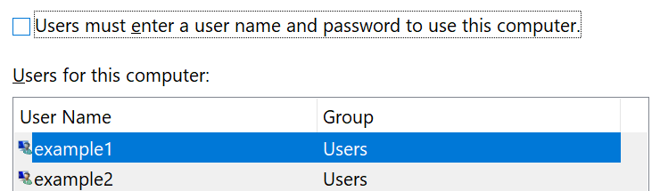

# Вхід у Windows 10 без використання пароля

Щоб не вводити пароль під час запуску Windows, радимо використовувати один із безпечних параметрів входу Windows, наприклад PIN-код, розпізнавання облич або відбитки пальців, якщо доступно. Якщо ви дійсно хочете вимкнути безпечну реєстрацію, ознайомтеся з наведеними нижче вказівками "автоматично входити в Windows 10".

**Захист облікового запису "Привіт" для Windows**

Послідовно виберіть елементи **настройки > облікові записи > Параметри входу** (або клацніть [тут](ms-settings:signinoptions?activationSource=GetHelp)). Доступні варіанти входу буде наведено в списку. Наприклад,

Клацніть або торкніться одного з параметрів, щоб настроїти його. Під час наступного запуску або розблокування Windows ви зможете використовувати новий параметр замість пароля. 

**Автоматичне входу в ОС Windows 10**

**Примітка**: функція автоматичного входу зручна, але вона вводить ризик для безпеки, особливо якщо комп'ютер доступний для кількох користувачів. 

1. Клацніть або торкніться кнопки **Пуск** на панелі завдань.

2. Введіть **netplwiz** і натисніть клавішу "ввести", щоб відкрити вікно "облікові записи користувачів".

3. У розділі **облікові записи користувачів**виберіть обліковий запис, який потрібно автоматично ввійти під час завантаження Windows.

4. Зніміть прапорець "користувачі мають ввести ім'я користувача та пароль, щоб використовувати цей комп'ютер".

    

5. Натисніть кнопку **OK**. З'явиться запит на введення та підтвердження пароля для вибраного облікового запису. Натисніть кнопку **OK** , щоб завершити. Під час наступного завантаження Windows 10 буде автоматично входити в вибраний обліковий запис.
