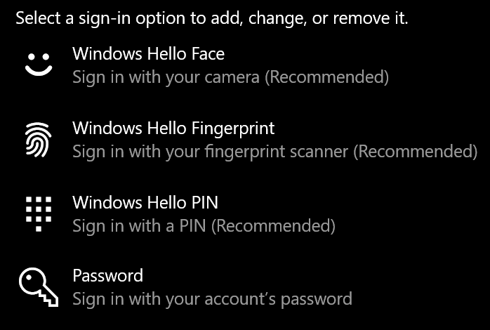

# Вхід у Windows 10 без використання пароляSign-in to Windows 10 without using a password

Щоб не вводити пароль під час запуску Windows, радимо скористатися одним із параметрів безпечного входу у Windows Hello, як-от PIN-код, розпізнавання обличчя або відбитки пальців, якщо вони доступні.To avoid having to type a password at Windows startup, we recommend you use one of the Windows Hello secure sign-in options, like a PIN, face recognition, or fingerprint, if available. Якщо ви справді хочете вимкнути безпечний вхід, див. наведені нижче інструкції "Автоматичний вхід у Windows 10".If you really want to disable secure sign-in, see the "Automatically sign in to Windows 10" instructions below.

**Захист Windows Hello альтернативні пароля облікового запису****Secure Windows Hello alternatives to the account password**

Виберіть елементи **Настройки > Облікові > параметри входу** (або клацніть [тут).](ms-settings:signinoptions?activationSource=GetHelp)Go to **Settings  > Accounts > Sign-in options** (or click [here](ms-settings:signinoptions?activationSource=GetHelp)). З'являться доступні параметри входу.Available sign-in options will be listed. Наприклад:For example:

Виберіть один із параметрів, щоб настроїти його.Click or tap one of the options to configure it. Під час наступного запуску або розблокування Windows можна буде використовувати новий параметр замість пароля.Next time you start or unlock Windows, you will be able to use the new option instead of a password. 

**Автоматичний вхід у Windows 10****Automatically sign-in to Windows 10**

**Примітка.** Автоматичний вхід зручний, але впроваджує загрозу безпеці, особливо якщо ПК доступний кільком користувачам.**Note**: Automatic sign-in is convenient, but introduces a security risk, especially if your PC is accessible by multiple people. 

1. Натисніть кнопку **Пуск** на панелі завдань.Click or tap the **Start** button in the Taskbar.

2. Введіть **netplwiz і** натисніть клавішу Enter, щоб відкрити вікно "Облікові записи користувачів".Type **netplwiz** and hit the Enter key to open the User Accounts window.

3. У **полі Облікові** записи користувачів виберіть обліковий запис, у який потрібно автоматично входити під час запуску Windows.In **User Accounts**, click the account you want to automatically sign in to when Windows starts.

4. Зніміть прапорець "Користувачі повинні вводити ім'я користувача та пароль для використання цього комп'ютера".Uncheck the "Users must enter a user name and password to use this computer" checkbox.

    

5. Натисніть кнопку **OK**.Click **OK**. Вам буде запропоновано ввести та підтвердити пароль для вибраного облікового запису.You will be asked to enter and confirm the password for the account you selected. Натисніть **кнопку OK,** щоб завершити.Click **OK** to finish. Під час наступного запуску Windows 10 вона автоматично ввійме у вибраний обліковий запис.Next time Windows 10 starts, it will automatically sign in to the account you selected.
