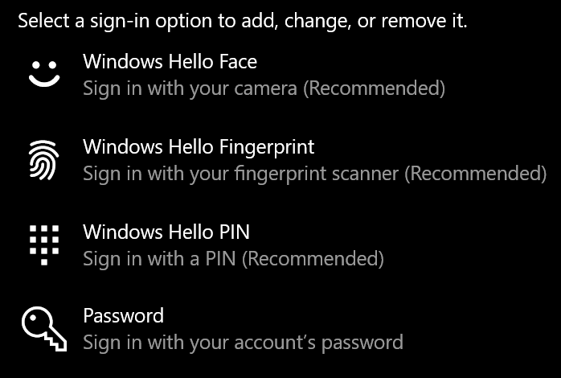
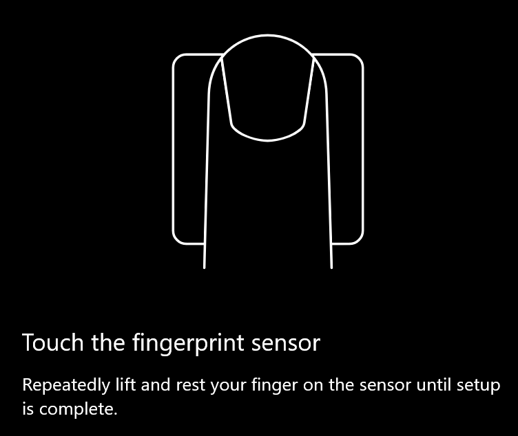
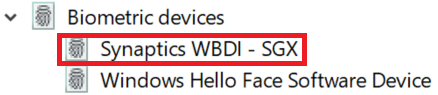

# Використання параметра розблокування відбитків пальців у Windows 10Use fingerprint unlock option in Windows 10

**Увімкнути відбиток пальця Windows Hello****Enable Windows Hello Fingerprint**

Щоб розблокувати Windows 10 за допомогою відбитків пальців, потрібно настроїти відбиток пальця Windows Hello за допомогою додавання (дозволити Windows навчитися розпізнавати) принаймні один палець.To unlock Windows 10 using your fingerprint, you need to set up Windows Hello Fingerprint by adding (letting Windows learn to recognize) at least one finger. 

1. Перейдіть до **налаштувань > облікових записів > Параметри входу** (або натисніть [тут](ms-settings:signinoptions?activationSource=GetHelp)).Go to **Settings  > Accounts > Sign-in options** (or click [here](ms-settings:signinoptions?activationSource=GetHelp)). Доступні Параметри входу будуть перераховані.Available sign-in options will be listed. Наприклад,For example:

    

2. Клацніть або торкніться **відбитків пальців Windows Hello**, а потім натисніть кнопку **настроїти**.Click or tap **Windows Hello Fingerprint**, then click **Set up**. У вікні Настроювання Windows **Hello натисніть кнопку почати.**In the Windows Hello setup window, click **Get started**. Буде активовано датчик відбитків пальців, і вам буде запропоновано помістити палець на датчик:The fingerprint sensor will activate, and you'll be asked to place your finger on the sensor:

   

3. Дотримуйтесь інструкцій, які будуть просити вас повторно сканувати палець.Follow the instructions, which will ask you to repeatedly scan your finger. Коли це буде закінчено, ви матимете можливість додати інші пальці, які ви можете використовувати для входу.When this is finished, you'll have the option of adding other fingers you may want to use for sign-in. Наступного разу, коли ви входите у Windows 10, ви будете мати можливість використовувати відбиток пальця, щоб зробити це.Next time you sign in to Windows 10, you will have the option of using your fingerprint to do so.

**Відбиток пальця Windows Hello недоступний як параметр входу****Windows Hello Fingerprint not available as a sign-in option**

Якщо в **параметрах входу**немає функції відбитків пальців Windows Hello, це означає, що Windows не відомо про будь-який сканер відбитків пальців або сканера, ПІДКЛЮЧЕНИЙ до ПК, або що системна політика запобігає його використанню (якщо, наприклад, ваш ПК керує вашим робочим місцем).If Windows Hello Fingerprint is not shown as an option in **Sign-in options**, it means Windows is not aware of any fingerprint reader/scanner attached to your PC, or that a system policy prevents its use (if for example your PC is managed by your workplace). Щоб усунути неполадки:To troubleshoot: 

1. Натисніть кнопку **Пуск** на панелі завдань і знайдіть **Диспетчер пристроїв**.Select the **Start** button in the Taskbar and search for **Device Manager**.

2. Клацніть або торкніться, щоб відкрити **Диспетчер пристроїв**.Click or tap to open **Device Manager**.

3. У диспетчері пристроїв розгорніть вузол Біометричні пристрої, клацнувши його Шеврон.In Device Manager, expand Biometric devices by clicking its chevron.

   

4. Сканер відбитків пальців повинен бути вказаний як біометричний пристрій, наприклад Synaptics WBDI Scanner:Your fingerprint scanner should be listed as a biometric device, such as the Synaptics WBDI scanner:

   

5. Якщо сканер відбитків пальців не відображається, а сканер інтегрований у ваш ПК, перейдіть на веб-сайт виробника комп'ютера.If your fingerprint scanner is not shown, and the scanner is integrated into your PC, go to the PC manufacturer's website. У розділі технічної підтримки для моделі ПК знайдіть драйвер Windows 10 для сканера, який можна інсталювати.In the technical support section for your PC model, search for a Windows 10 driver for a scanner that you can install.

6. Якщо сканер відділено від ПК (додається через USB), перейдіть на веб-сайт виробника сканера, щоб знайти та інсталювати програмне забезпечення драйвера пристрою Windows 10 для моделі сканера.If the scanner is separate from the PC (attached via USB), go to the scanner manufacturer's website to find and install Windows 10 device driver software for the scanner model you have.
