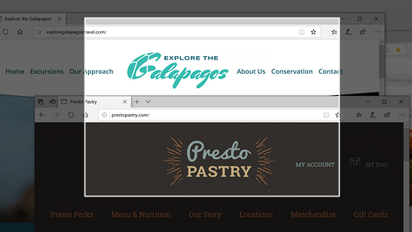
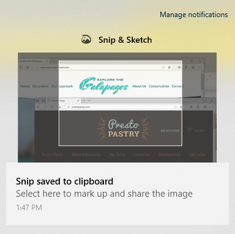

# Використання фрагмента & начерк для записування, розмітки та спільного використання зображень

Ескіз екрана тепер називається **фрагмент & ескіз**. **Щоб швидко взяти фрагмент**:

1. Натисніть клавішу з **емблемою Windows + Shift + S**. Ви побачите екран темніє, а курсор відображається як хрест. 

2. Виберіть точку на краю області, яку потрібно скопіювати, і клацніть лівою кнопкою миші курсором. 

3. Перемістіть курсор, щоб виділити область, яку ви хочете захопити. Область, яку ви захопіть, з'явиться на екрані.

   

Зображення, яке ви снімпили, зберігається в буфер обміну, готовий до вставки в електронний лист або документ. 

**Якщо ви хочете відредагувати або переглянути зображення**: 

- Натисніть значок сповіщень у крайньому правому боці панелі завдань; потім виберіть зображення, яке ви щойно захопили. Ваш фрагмент відкриється у програмі "фрагмент & ескіз".

   
