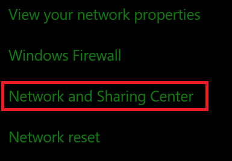
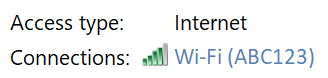
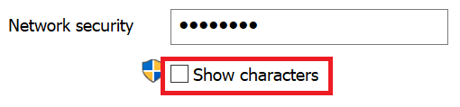

# Перегляд Wi-Fi пароля мережі у Windows 10View Wi-Fi network password in Windows 10

1. Переконайтеся, що комп'ютер із Windows 10 підключено до Wi-Fi мережі.Make sure your Windows 10 PC is connected to the Wi-Fi network.

2. Виберіть елементи **Настройки > Мережі & Стан** підключення до > Інтернету  або клацніть тут, щоб поїхати звідси.)Go to **Settings  > Network & Internet  > Status**, or click or tap [here](ms-settings:network?activationSource=GetHelp) to let us take you there now.)

3. Виберіть елемент **Центр мережних підключень і спільного доступу.**Click **Network and Sharing Center**.

    

4. У **центрі мереж і спільного доступу** поруч із **пунктом** Підключення відображається ім'я безпровідної мережі.In **Network and Sharing Center**, next to **Connections**, you will see the name of your wireless network. Наприклад, якщо ваша мережа має назву "ABC123", може з'явитись таке повідомлення:For example, if your network is named "ABC123," you might see:

    

    Клацніть ім'я безпровідної мережі, щоб відкрити Wi-Fi вікно Стан.Click the wireless network name to open the Wi-Fi Status window. 

5. У вікні Wi-Fi стан натисніть кнопку Властивості **безпровідної мережі,** перейдіть на **вкладку** Безпека та встановіть прапорець **Відображати символи.**In the Wi-Fi Status window, click **Wireless Properties**, click the **Security** tab, and check **Show characters**.

    

